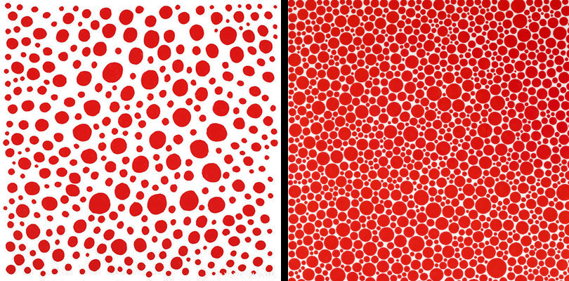
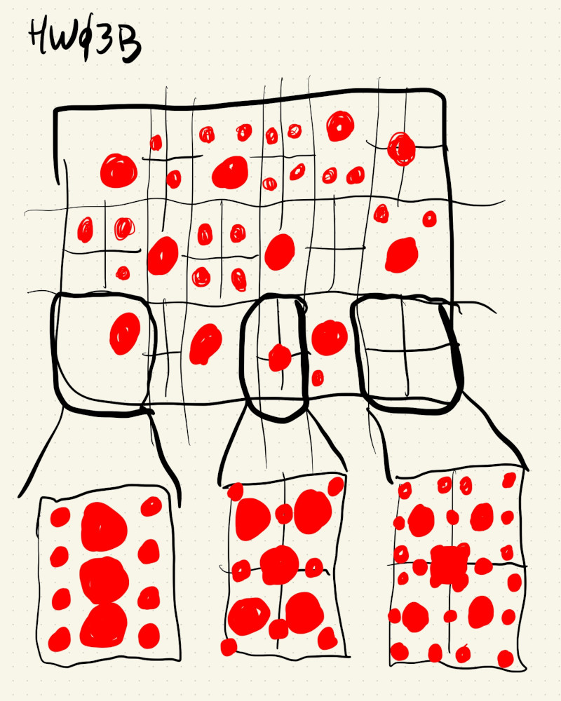
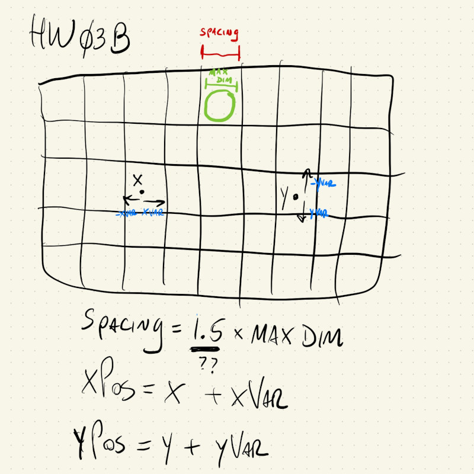

# HW03B

This is a sketch that draws an irregular pattern of circles based on some of the patterns of Yayoi Kusama:



The first way I thought about implementing this involved creating a grid, and then for some of the grid spaces I would place a large circle, and for others I would create a sub-grid, where different pre-determined patterns could be drawn. Even though they would be pre-determined patterns, their x and y positions would be shifted using ```random()```, so it would still be irregular in the end.

This was my sketch for this idea:



But, this turned out to be a little more difficult to implement and I wasn't so sure that the results would be very different form something a little bit simpler, like this:



Start with a regular grid, and in each position I can pick from one of 3 pre-determined circles diameters using the [random lottery logic](https://dm-gy-6063-2023f-d.github.io/tutorial/random-lottery/). In the same if/else blocks where I select the size of the circle I can also select the range of the variation for the x and y shifts. Smaller circles can have larger variation and bigger circles should have smaller variation to avoid overlapping with neighbors.

In order to have larger variations I made the grid spacing a little bit bigger than the largest circle size. Initially I had:

```
let spacing = 1.5 * maxDiameter;
```

But after some tests I saw that ```1.2``` gave something with a little bit more circles and not too many overlaps:

```
let spacing = 1.2 * maxDiameter;
```
